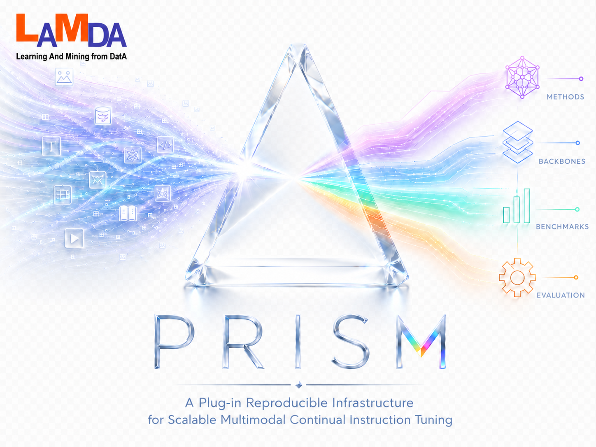

# PRISM: Multimodal Continual Instruction Tuning Toolbox

<p align="center">
  
</p>

---

<p align="center">
  <a href="#introduction">Introduction</a> •
  <a href="#methods-implemented">Methods Implemented</a> •
  <a href="#how-to-use">How To Use</a> •
  <a href="#datasets">Datasets</a> •
  <a href="#configuration">Configuration</a> •
  <a href="#license">License</a> •
  <a href="#acknowledgments">Acknowledgments</a> •
  <a href="#contact">Contact</a>
</p>

---

<div align="center">

[](https://www.python.org/)
[](https://pytorch.org/)
[](https://www.deepspeed.ai/)

</div>

**PRISM** is a plug-in, reproducible toolbox for training and evaluating **multimodal large language models (MLLMs)** under **continual instruction tuning (MCIT)**. A single entry point (`run.py`) orchestrates sequential task training, inference, and evaluation across multiple benchmarks and continual-learning methods.

If you use this repository, please cite:

```bibtex
@article{tang2026prism,
  title={Prism: A Plug-in Reproducible Infrastructure for Scalable Multimodal Continual Instruction Tuning},
  author={Jun-Tao Tang and Yu-Cheng Shi and Zhen-Hao Xie and Da-Wei Zhou},
  year={2026},
  journal={arXiv preprint arXiv:2605.26110},
}

@inproceedings{xie2026same,
  title={SAME: Stabilized Mixture-of-Experts for Multimodal Continual Instruction Tuning},
  author={Xie, Zhen-Hao and Tang, Jun-Tao and Shi, Yu-Cheng and Ye, Han-Jia and Zhan, De-Chuan and Zhou, Da-Wei},
  booktitle={ICML},
  year={2026}
}
```

## Introduction

Multimodal large language models (MLLMs) unify diverse vision and vision–language tasks into a shared instruction-following format. In real deployments, however, data and instructions arrive as streams: models must learn new tasks sequentially without erasing earlier capabilities. Standard fine-tuning suffers from catastrophic forgetting under this setting.

**Multimodal continual instruction tuning (MCIT)** addresses this by training MLLMs on a sequence of instruction-tuning stages while preserving performance on prior tasks. PRISM standardizes this workflow—benchmark definitions, method integrations, checkpoint layout, and evaluation—so that MCIT methods can be compared and extended under one infrastructure.

## Methods Implemented

Each method is selected with `--method <id>` (folder under `method/custom/<id>/`). Below: **abbreviation** — paper title (link).

| Abbr. | `--method` | Paper |
|-------|------------|-------|
| HiDe | `hide_llava` | [HiDe-LLaVA: Hierarchical Decoupling for Continual Instruction Tuning of Multimodal Large Language Model](https://arxiv.org/abs/2503.12941) |
| Replay+LoRA | `replay_lora` | [LoRA: Low-Rank Adaptation of Large Language Models](https://arxiv.org/abs/2106.09685) |
| LoRA | `ft_lora` | [LoRA: Low-Rank Adaptation of Large Language Models](https://arxiv.org/abs/2106.09685) |
| O-LoRA | `olora` | [Orthogonal Subspace Learning for Language Model Continual Learning](https://arxiv.org/abs/2310.14152) |
| SMoLoRA | `smolora` | [SMoLoRA: Exploring and Defying Dual Catastrophic Forgetting in Continual Visual Instruction Tuning](https://arxiv.org/abs/2411.13949) |
| MoELoRA | `moelora` | [CoIN: A Benchmark of Continual Instruction tuNing for Multimodel Large Language Model](https://arxiv.org/abs/2403.08350) |
| CL-MoE | `clmoe` | [CL-MoE: Enhancing Multimodal Large Language Model with Dual Momentum Mixture-of-Experts for Continual Visual Question Answering](https://arxiv.org/abs/2503.00413) |
| ModalPrompt | `modal_prompt` | [ModalPrompt: Towards Efficient Multimodal Continual Instruction Tuning with Dual-Modality Guided Prompt](https://arxiv.org/abs/2410.05849) |
| EWC | `ewc` | [Overcoming catastrophic forgetting in neural networks](https://arxiv.org/abs/1612.00796) |
| DisCo | `disco` | [Federated Continual Instruction Tuning](https://arxiv.org/abs/2503.12897) |
| SAME | `same` | [SAME: Stabilized Mixture-of-Experts for Multimodal Continual Instruction Tuning](https://arxiv.org/abs/2602.01990) |
| Zero-shot | `zeroshot` | [Visual Instruction Tuning](https://arxiv.org/abs/2304.08485) *(infer only)* |

To add a method, implement `method/custom/<your_method>/integration.py` and register with `@CLMethodFactory.register("your_method")`.

## How To Use

Install dependencies (`pip install -r requirements/torch.txt`, then `pip install -r requirements.txt`), set paths in `config/paths/llava_paths.py`, and edit `config/run_config.py` (and `config/methods/<method>.py` if needed).

After configuration, run a quick **zero-shot** inference on a single task to check that model weights, data paths, and GPUs are set up correctly (`zeroshot` uses the base MLLM checkpoint only):

```bash
python run.py infer 0 --method zeroshot
```

Then run continual training and evaluation:

```bash
python run.py train 0 1 2
python run.py infer 0 1 2
```

**`0`, `1`, `2` are task indices** (see `config/benchmarks/<benchmark>.py`). You may train any tasks you need; stage *k* resumes from task *k*−1’s checkpoint. For **inference**, choose the checkpoint in `config/run_config.py`. 

CLI flags override config; omitted flags use config defaults.

## Datasets

PRISM currently supports three benchmarks:

| Benchmark | `--benchmark` | Tasks | Reference |
|-----------|---------------|-------|-----------|
| **CoIN** | `coin` | 8 | [Paper](https://arxiv.org/abs/2403.08350) · [Code](https://github.com/zackschen/CoIN/tree/CoIN) |
| **UCIT** | `ucit` | 6 | [Paper](https://arxiv.org/abs/2503.12941) · [Code](https://github.com/Ghy0501/HiDe-LLaVA) |
| **TriGap** | `trigap` | 10 | [SAME (ICML 2026)](https://arxiv.org/abs/2602.01990) · [Instructions (Hugging Face)](https://huggingface.co/datasets/JuntaoTang/TriGap) |

**CoIN / UCIT** — Follow the upstream repos to download instruction JSON and images. For **UCIT**, a typical layout under your data root is:

Set `PRISM_ROOT` (or the benchmark-specific dirs in `config/benchmarks/UCIT.py`) to point to these folders. **CoIN** follows the same `instructions/` + `datasets/` pattern under `PRISM_ROOT`; see `config/benchmarks/CoIN.py`.

**TriGap** — A longer, harder benchmark introduced with SAME. Download instruction files from [Hugging Face](https://huggingface.co/datasets/JuntaoTang/TriGap) and the corresponding image data, then organize them as:

```
TriGap/
├── instructions/
└── datasets/
```

Set paths in `config/paths/llava_paths.py` and in the benchmark file under `config/benchmarks/`, for example in `TriGap.py`:

```python
TRIGAP_INSTRUCTION_DIR = "/path/to/TriGap/instructions"
TRIGAP_IMAGE_DIR = "/path/to/TriGap/datasets"
```

**UCIT subsampled splits** — You can use smaller `_sub` instruction JSON files; pass `--use-sub-dataset` (or set `use_sub_dataset` in `config/run_config.py`) so paths use the `_sub` suffix (see `utils/sub_dataset.py`).

**Custom benchmarks** — Add a task list under `config/benchmarks/<name>.py` and register it in `config/benchmarks/__init__.py`.

## Configuration

| File | Purpose |
|------|---------|
| `config/paths/llava_paths.py` | Model, data, checkpoint, and result paths |
| `config/run_config.py` | Global `train` / `infer` CLI defaults |
| `config/methods/<method>.py` | Per-method training flags and batch sizes |
| `config/benchmarks/<benchmark>.py` | Task definitions and eval hooks |

CLI arguments override file defaults when both are set.

## License


## Acknowledgments

We thank the the following projects for their benchmark and reference implementations used in PRISM:

- [HiDe-LLaVA](https://github.com/Ghy0501/HiDe-LLaVA)
- [CoIN](https://github.com/zackschen/CoIN/tree/CoIN)
- [MCITlib](https://github.com/Ghy0501/MCITlib)

## Contact

If you have any questions, please feel free to propose new features by opening an issue or contact the authors: Jun-Tao Tang ([juntao.tang@smail.nju.edu.cn](mailto:juntao.tang@smail.nju.edu.cn)), Yu-Cheng Shi ([231250034@smail.nju.edu.cn](mailto:231250034@smail.nju.edu.cn)), and Da-Wei Zhou ([zhoudw@lamda.nju.edu.cn](mailto:zhoudw@lamda.nju.edu.cn)). Enjoy the code.
